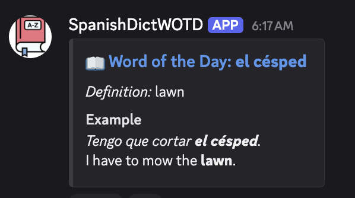

# 📖 SpanishDict WOTD Discord Bot


A lightweight Python script that fetches the **Word of the Day** from [SpanishDict](https://www.spanishdict.com/wordoftheday) or [FrenchDictionary](https://frenchdictionary.com/wordoftheday) and posts it to a Discord or Slack channel via a **webhook**.




## 🔧 Features

- ✅ Supports Spanish from https://www.spanishdict.com
- ✅ Supports Frech from https://www.frenchdictionary.com
- ✅ Supports a bunch of other langauges from https://www.innovativelanguage.com/word-of-the-day/ (Afrikaans, Arabic, Bulgarian, Cantonese, Chinese, Croatian, Czech, Danish, Dutch, Filipino, Finnish, French, German, Greek, Hebrew, Hindi, Hungarian, Indonesian, Italian, Japanese, Korean, Malaysian, Mongolian, Nepali, Norwegian, Persian, Polish, Portuguese, Romanian, Russian, Serbian, Spanish, Swahili, Swedish, Thai, Turkish, Ukrainian, Urdu, Vietnamese)
- ✅ Posts to Discord using webhooks (no bot login needed)
- ✅ `--slack` for posting to Slack (defaults to Discord)
- ✅ Automatically avoids duplicate posts with a history file
- ✅ `--dry-run` mode for testing
- ✅ Cron-compatible for daily automation

---

## 🚀 Usage

### 🖥️ Command Line

```bash
python3 wotd_post.py --webhook-url <URL> --lang spanish
```

Or set the webhook via environment variable:

```
export DISCORD_WEBHOOK="https://discord.com/api/webhooks/..."
python3 wotd_post.py --lang french
```


### ⚙️ Options


| Option                | Short  | Default                                                     | Description                |
|-----------------------|--------|-----------------------------------------------------------------|------------------------|
| `--webhook-url <URL>` | `-w`   | `$DISCORD_WEBHOOK` |Discord or Slack incoming webhook URL to post into   |
| `--slack` |  | Discord | Post to Slack instead of Discord |
| `--lang <language>` | `-l`   | spanish | Language source to use (spanish or french) |
| `--history-file <PATH>` | `-f`   | `sent_wotd.txt` | File to track previously posted words |
| `--dry-run` | | *disabled* | Print the embed payload instead of posting |
| `--debug` | | *disabled* | Additional debug logging |


**NOTE**: The script writes to `sent_wotd.txt` in the same directoryto avoid sending duplicate words. The user running the script must have write access to the file (and the directory if the file does not exist to create it). 


## Requirements

- Python 3.9+

Install dependencies with:

```bash
pip install -r requirements.txt
```

## License

MIT

